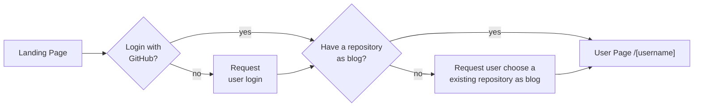

[Demo](https://gitpost.up.railway.app) (The site may crush due to deployment service or database sleeping, if you encounter any problem in demo website, feel free to contact me)

## Introduction

This Dcard 2024 Frontend Intern Homework, whose goal is to connect with GitHub OAuth API to implement login, and user can create open issue as their blog post, close issue as deleting post.
Author can "read", "create", "edit", "delete" their post and comment, and others can only "read" post and comment.

## Tack Stack

- Next.js + TypeScript
- Tailwind CSS - Styling
- [ShadcnUI](https://ui.shadcn.com/) - Component Library
- [Zustand](https://zustand-demo.pmnd.rs/) - State Management
- [react-markdown](https://remarkjs.github.io/react-markdown/) + [react-markdown-editor](https://uiwjs.github.io/react-markdown-editor/) + [next-remote-mdx](https://www.npmjs.com/package/next-mdx-remote) + [Tailwind CSS Typography](https://github.com/tailwindlabs/tailwindcss-typography) - Rendering Markdown and Markdown Editor
- Axios -Sending API Request
- GitHub OAuth API - User Login
- [Turso](https://turso.tech/) - Database
- [Prisma ORM](https://www.prisma.io/orm) - ORM for Mutating Data

## Getting Started

First, set environment variable:

```ts
GITHUB_CLIENT_ID=
GITHUB_CLIENT_SECRET=

SECRET_KEY=

TURSO_DATABASE_URL=
TURSO_AUTH_TOKEN=

BASE_URL=
```

Second, run the development server:

```bash
npm run dev
# or
yarn dev
# or
pnpm dev
# or
bun dev
```

Open [http://localhost:3000](http://localhost:3000) with your browser to see the result.

## How It Works



### Route

- `/` - landing page, a login button to authentication page or a redirect botton to `[username]` if user have logined
- `/callback` - a page where authentication page redirected to, used to take its query parameter `code` and send to GitHub API for obtaining user's information and access token, then save them all as JWT
- `/select-repo` - let user select a existing repository as their blog

The following routes have layout which contains a sidebar (or header for small screen size) to let user create post, redirect to their blog page, or logout

- `/[username]` - User's blog page, which shows the latest ten posts at first, and when scrolling down to bottom it fetches next ten posts. Each posts is linked to their `/[username]/[postNum]` page
- `/[username]/[postNum]` - post page, where all user can read post or leave a comment but only author can edit and delete the post
